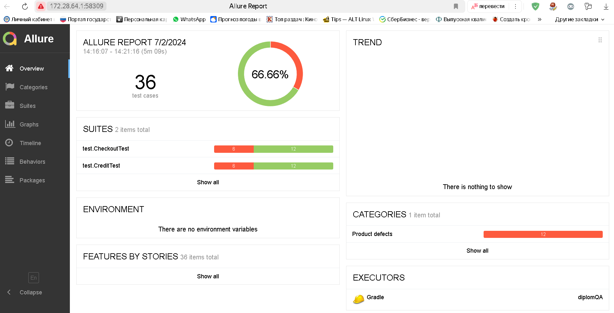

# Отчет о проведенном тестировании

## Краткое описание

### Было проведено тестирование комплексного сервиса, взаимодействующего с СУБД и API Банка.

#### Приложение представляет собой веб-сервис, который предоставляет возможность купить тур по определённой цене с помощью двух способов:

* Обычная оплата по дебетовой карте
* Уникальная технология: выдача кредита по данным банковской карты

#### На начальном этапе было проведено исследовательское (ручное) тестирование для ознакомления с проектом.

#### На следующем этапе были созданы авто-тесты, согласно Плана автоматизации тестирования.

#### Тестирование было проведено для двух баз данных - MySQL и PostgreSQL.

##### Количество тест-кейсов:

* Общее количество тестовых сценариев 36

##### При подключении к СУБД MySQL

* 66.6% - тестов пройдено успешно,
* 33.4% - провалены

### Общие рекомендации

* Исправить визуальные и орфографические ошибки, заведенные в [репорты Issues]()
* Кнопки "купить" и "купить в кредит" сделать одинаковым цветом чтобы при нажатии на одну из кнопок (раздел выделялся
  другим цветом) и было понятно, где именно находишься
* Проверить настройки валидации полей, исправить подсказки для пользователей (например, если поле не заполнено -
  сообщение "Поле обязательно для заполнения")